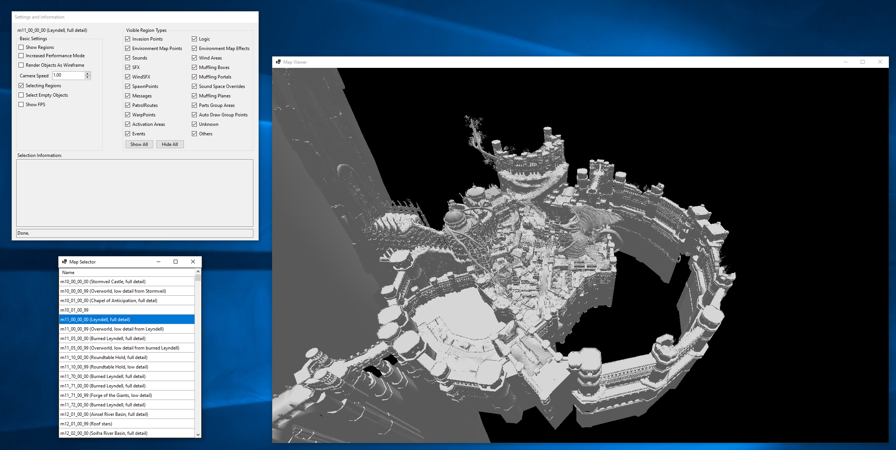
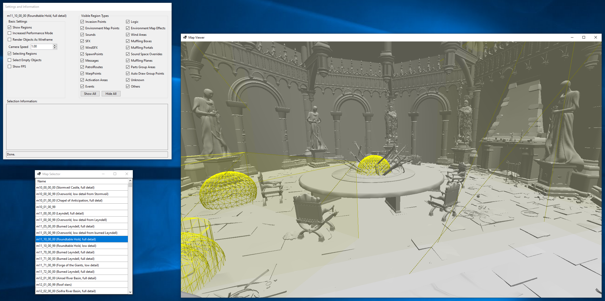

# ERMapViewer

ERMapViewer is a program for viewing maps from Elden Ring in 3D. Depends on SoulsFormats (intended for use with my fork that includes sort-of support for Elden Ring).

On startup, select your `eldenring.exe`. Initial loading will take a while because the .bhd files are RSA encrypted. Smaller maps shouls load quickly. Larger maps will take up huge amounts of RAM, up to nearly double digits on occasion.

Performance should be relatively good. On my GTX 1080 + 5600X I get 60 FPS on nearly all maps - basically everything except Leyndell when the entire map is in view; the program makes use of LOD meshes and frustum culling (though my LOD algorithm is very basic).

## Controls

| Key | Action |
| --- | --- |
| W | Forwards |
| A | Left |
| S | Backwards |
| D | Right |
| Q | Up |
| E | Down |
| Shift | Move faster |
| Alt | Move slower |
| Ctrl | Move much slower |
| Up | Increase camera speed |
| Down | Decrease camera speed |
| LMB | Look |
| RMB | Select |
| N | Next item in selection |
| Shift + N | Previous item in selection |
| R | Reset camera |
| F | Draw current view frustum |
| C | Draw current camera position |

## Screenshots

